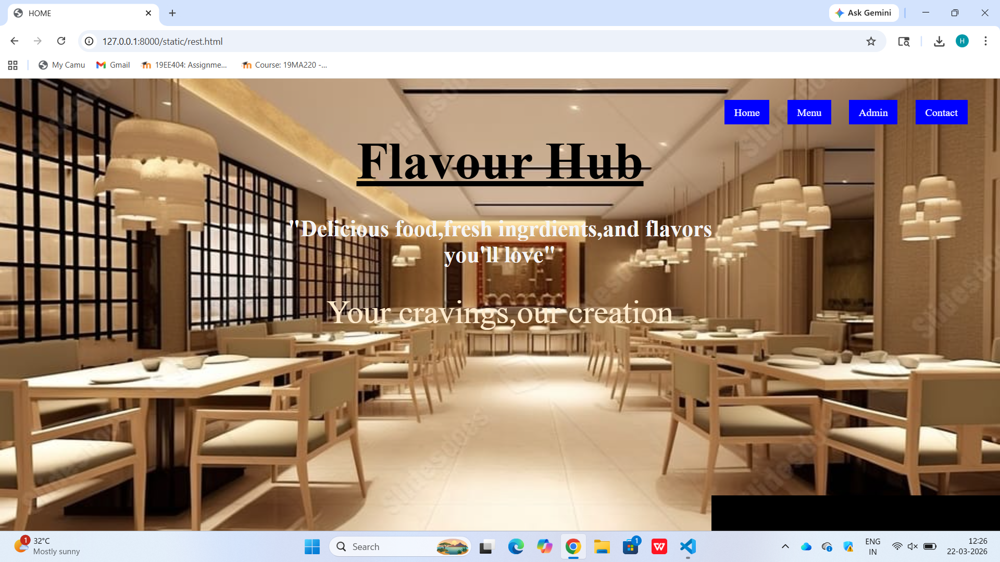
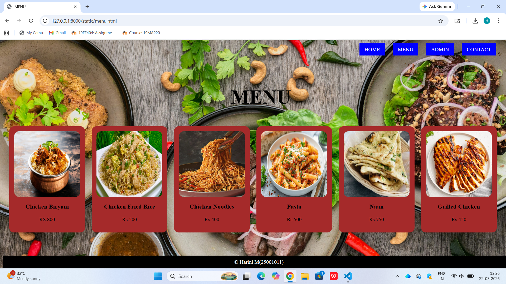
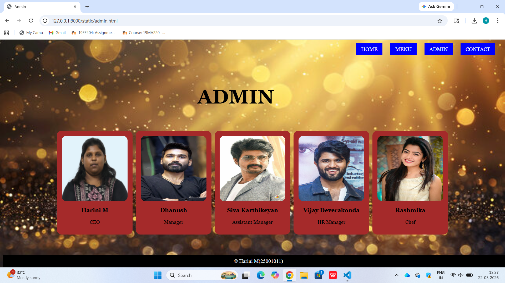
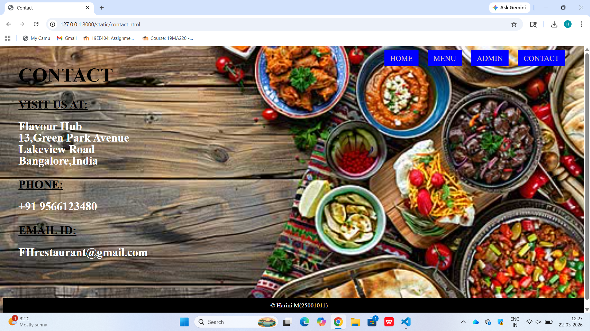

# Ex.06 Restaurant Website
## Date:18.03.2026

## AIM:
To develop a static Restaurant website to display the food items and services provided by them.

## DESIGN STEPS:

### Step 1:
Requirement collection.

### Step 2:
Creating the layout using HTML and CSS.

### Step 3:
Updating the sample content.

### Step 4:
Choose the appropriate style and color scheme.

### Step 5:
Validate the layout in various browsers.

### Step 6:
Validate the HTML code.

### Step 7:
Publish the website in Localhost.

## PROGRAM:
```
rest.html

<html>
    <head>
        <title>
            HOME
        </title>
        <link rel="stylesheet" href="rest.css">
    </head>
    <body>
        <div class="heading">
            <p><u>Flavour Hub<u></u></p>
        </div>
        <div class="vision">
            <p>
                Your cravings,our creation
            </p>
        </div>
        <div class="About">
            <b>"Delicious food,fresh ingrdients,and flavors you'll love"</b>
        </div>
        <div class="header">
            <a href="rest.html">Home</a>
            <a href="menu.html">Menu</a>
            <a href="admin.html">Admin</a>
            <a href="contact.html">Contact</a>
        
        <div class="footer">&copy;Harini M(25001011)</div>
    </body>
</html>


rest.css


body{
    background-image: url("Hotel.jpeg");
    background-repeat: no-repeat;
    background-position: center;
    background-size: cover;
    margin: 0;
}
.heading{
    position: absolute;
    top: 0.5px;
    left: 0;
    right: 0;
    text-align: center;
    font-family: 'Times New Roman', Times, serif;  
    font-size: 80px;
    font-weight: bolder;
    color:black; 
}
.about{
    position: absolute;
    top: 210px;
    left: 0;
    right: 0;
    width: 700px;
    margin: auto;
    text-align: center;
    font-family: 'Times New Roman', Times, serif;
    font-size: 35px;
    color: white;
}
a:hover{
    background-color:rgb(53, 7, 118);
    color:white;
}
.vision{
    position: absolute;
    top: 280px;
    left: 0;
    right: 0;
    text-align: center;
    font-family: 'Times New Roman', Times, serif;
    font-size: 50px;
    font-family: 'Times New Roman', Times, serif;
    color: blanchedalmond; 
}
.header{
    position: fixed;
    top: 30px;
    right: 50px;
    font-family: 'Times New Roman', Times, serif; 
    font-size: 30px;
    color:white;
}
.header a {
    text-decoration: none;
    margin-left: 20px;
    padding: 10px 15px;
    background-color: blue;
    color:white;
    font-size: 16px;
}
.img{
    position: relative;
    top: 470px;
    text-align: center;
}

.footer{
    position: fixed;
    bottom: 0;
    width: 100%;
    background-color: black; 
    color: white; 
    text-align: center;
    font-family: 'Times New Roman', Times, serif; 
    padding: 10px;
}

menu.html

<html>
<head>
    <title>MENU</title>
    <link rel="stylesheet" href="menu.css">
</head>
<body>
    <div class="nav">
        <a href="rest.html">HOME</a>
        <a href="menu.html">MENU</a>
        <a href="admin.html">ADMIN</a>
        <a href="contact.html">CONTACT</a>
    </div>
    <h1 class="menu">MENU</h1>
    <br>
    <br>
    <br>
    <div class="container">
        <div class="list">
            
            <h3>Chicken Biryani</h3>
            <p>RS.800</p>
        </div>
        <div class="list">
            
            <h3>Chicken Fried Rice</h3>
            <p>Rs.500</p>
        </div>
        <div class="list">
            
            <h3>Chicken Noodles</h3>
            <p>Rs.400</p>
        </div>
        <div class="list">
            
            <h3>Pasta</h3>
            <p>Rs.500</p>
        </div>
        <div class="list">
            
            <h3>Naan</h3>
            <p>Rs.750</p>
        </div>
        <div class="list">
            
            <h3>Grilled Chicken</h3>
            <p>Rs.450</p>
        </div>
        
        
    </div>
    <div class="footer">&copy; Harini M(25001011)</div>
</body>
</html>


menu.css

body{
    background-image: url("bg.jpg");
    background-size: cover;
    background-position: center;
    font-family: 'Times New Roman', Times, serif;
}


.nav{
    position: absolute;
    top: 20px;
    right: 30px;
}

.nav a{
    text-decoration: none;
    margin-left: 20px;
    padding: 10px 15px;
    background-color: blue;
    color: WHITE;
    font-size: 16px;
}


.menu{
    position:absolute;
    top: 100px;
    text-align: center;
    left: 700px;
    font-size: 60px;
    color: rgb(0, 0, 0);
}


.container{
    position: relative;
    top: 200px;
    display: flex;
    justify-content: center;
    gap: 20px;
}


.list{
    background-color: brown;
    padding: 15px;
    text-align: center;
    border-radius: 15px;
}

.list img{
    width: 200px;
    height: 200px;
    border-radius: 15px;
}
.footer{
    position: fixed;
    bottom: 0;
    width: 100%;
    background-color: black; 
    color:white; 
    text-align: center;
    font-family: 'Times New Roman', Times, serif; 
    padding: 10px;
}

admin.html


<html>
<head>
    <title>Admin</title>
    <link rel="stylesheet" href="admin.css">
</head>
<body>
    <div class="nav">
        <a href="rest.html">HOME</a>
        <a href="menu.html">MENU</a>
        <a href="admin.html">ADMIN</a>
        <a href="contact.html">CONTACT</a>
    </div>
    <h1 class="admin">ADMIN</h1>
    <br>
    <br>
    <br>
    <br>
    <div class="menu">
        <div class="list">
            
            <h3>Harini M</h3> 
            <p>CEO</p>
        </div>
        <div class="list">
            
            <h3>Dhanush </h3>
            <p>Manager</p>
            
        </div>
        <div class="list">
            
            <h3>Siva Karthikeyan</h3>
            <p>Assistant Manager </p>
        </div>
        <div class="list">
            
            <h3>Vijay Deverakonda</h3>
            <p>HR Manager</p>
        </div>
        <div class="list">
            
            <h3>Rashmika</h3>
            <p>Chef</p>
        </div>
    </div>
    <div class="footer">&copy; Harini M(25001011)</div>
</body>
</html>

admin.css

body{
    background-image: url("Back.jpg");
    background-size: cover;
    background-position: center;
    font-family: Georgia, serif;
}


.nav{
    position: absolute;
    top: 20px;
    right: 30px;
}

.nav a{
    text-decoration: none;
    margin-left: 20px;
    padding: 10px 15px;
    background-color: blue;
    color: white;
    font-size: 16px;
}


.admin{
    position: absolute;
    top: 100px;
    text-align: center;
    left: 600px;
    font-size: 60px;
    color:rgb(0, 0, 0);
}


.menu{
    position: relative;
    top: 200px;
    display: flex;
    justify-content: center;
    gap: 10px;
}


.list{
    background-color:brown;
    padding: 15px;
    text-align: center;
    border-radius: 15px;
    font-size: 15px;
}

.list img{
    width: 200px;
    height:200px;
    border-radius: 15px;
}
 

.footer{
    position: fixed;
    bottom: 0;
    width: 100%;
    background-color:black; 
    color: white; 
    text-align: center;
    font-family: 'Times New Roman', Times, serif; 
    padding: 10px;
}

contact.html

<html>
<head>
    <title>Contact</title>
    <link rel="stylesheet" href="contact.css">
</head>
<body>
    <div class="nav">
        <a href="rest.html">HOME</a>
        <a href="menu.html">MENU</a>
        <a href="admin.html">ADMIN</a>
        <a href="contact.html">CONTACT</a>
    </div>
    </div>
    <div class="contact">
        <h1>CONTACT</h1>
        <div class="Details">
            <h2><u>VISIT US AT:</u></h2>
            <p>
                <b>Flavour Hub
                <br>
                13,Green Park Avenue
                <br>
                Lakeview Road
                <br>
                Bangalore,India</b>
            </p>

            <h2><u>PHONE:</u></h2>
            <p><b>+91 9566123480</b></p>

            <h2><u>EMAIL ID:</u></h2>
            <p><b>FHrestaurant@gmail.com</b></p>
        </div>
    </div>
    <div class="footer">&copy; Harini M(25001011)</div>
</body>
</html>


contact.css

body {
    height: 100vh;
    background-image: url("Contact.jpg");
    background-size: cover;
    background-position: center;
    color: white;
}

.nav{
    position: absolute;
    top: 10px;
    right: 300x;
    
    padding: 10px 20px;
    border-radius: 4px;
}

.nav{
    position: absolute;
    top: 10px;
    right: 30px;
}

.nav a{
    text-decoration: none;
    margin-left: 20px;
    padding: 10px 15px;
    background-color: blue;
    color: rgb(218, 194, 194);
    font-size: 20px;
}

.contact {
    padding: 5px 40px;
}

.contact h1 {
    font-size: 50px;
    color: rgb(0, 0, 0);
    margin-bottom: 30px;
    
}

.details h2 {
    font-size: 30px;
    margin-top: 20px;
    color: black;
}

.details p {
    font-size: 30px;
    line-height: 1;
    margin-top: 2px;
}
.footer{
    background-color: black;
    text-align: center;
    color:white;
    padding:10px;
    bottom: 0;
    width: 100%;
    position:fixed;
    
}

```
## OUTPUT:





## RESULT:
The program for designing software company website using HTML and CSS is completed successfully.
